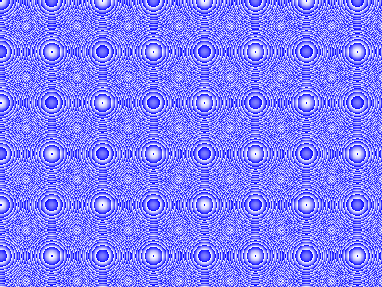

# go-tour-image

Code using OOP golang concepts generating an image with pixel manipulation.   

Result image: 
[]("image.png")

This line of code manipulate the image 
```
c := uint8(2*(x-x*x) - 2*(y*y-y))

``` 
You can modify it tho produce other interesting image results.

